# Image-Based Defect / Quality Classifier

An end-to-end ML system that automatically flags defective products from images captured on a manufacturing production line. The pipeline ingests and preprocesses product images, trains a classifier to distinguish defective from non-defective items, deploys it as an inference service, and monitors performance as new product variants or lighting conditions appear.

## Architecture Diagram

```mermaid
flowchart LR
  A["Kaggle casting images"] --> B

  subgraph M2["M2 - Data pipeline"]
    B["Ingest and normalize labels"] --> C["Validate images"]
    C --> D["Resize, RGB conversion, augmentation"]
    D --> E["Stratified train / val / test splits"]
  end

  subgraph M3["M3 - Training and tracking"]
    E --> F["CNN baseline"]
    E --> G["ResNet18 / EfficientNet-B0"]
    F --> H["MLflow metrics and artifacts"]
    G --> H
    H --> I["Best checkpoint"]
  end

  subgraph M4["M4 - Packaging and serving"]
    I --> J["TorchScript / ONNX export"]
    I --> K["FastAPI REST API"]
    K --> L["/health, /predict, /predict/batch"]
  end

  subgraph M5["M5 - Monitoring and retraining"]
    L --> N["Prediction logs"]
    N --> O["Confidence, KS-test, image drift"]
    O --> P["Retraining trigger"]
    P -. "new labeled data" .-> D
  end
```



## Project Structure

```
defect-classifier/
├── data/                    # Data directory (DVC tracked)
│   ├── raw/                 # Original dataset images
│   ├── processed/           # Preprocessed (resized, RGB) images
│   └── splits/              # Train/val/test stratified splits
├── src/
│   ├── data/                # M2: Ingestion, validation, preprocessing
│   │   ├── ingest.py        # Download from Kaggle or local source
│   │   ├── validate.py      # Image integrity & quality checks
│   │   └── preprocess.py    # Resize, normalize, split
│   ├── training/            # M3: Model training & experiments
│   │   ├── models.py        # CNN Baseline, ResNet18, EfficientNet-B0
│   │   ├── dataset.py       # PyTorch Dataset & DataLoaders
│   │   ├── train.py         # Training loop with MLflow tracking
│   │   └── run_experiments.py  # Multi-model comparison runner
│   ├── serving/             # M4: Production API
│   │   ├── app.py           # FastAPI REST endpoints
│   │   └── export_model.py  # TorchScript/ONNX export & benchmarking
│   └── monitoring/          # M5: Drift & retraining
│       ├── drift_detector.py    # Multi-signal drift detection
│       ├── simulate_drift.py    # Drift simulation experiments
│       └── retrain_strategy.py  # Retraining trigger logic
├── configs/
│   └── train_config.yaml    # All hyperparameters (single source of truth)
├── models/                  # Saved model checkpoints
├── docs/                    # Reports & documentation
│   ├── model_comparison.md  # Experiment comparison report
│   ├── drift_report.md      # Drift simulation findings
│   └── retraining_design.md # Retraining strategy document
├── logs/                    # Monitoring & prediction logs
├── notebooks/               # Exploration notebooks
├── dvc.yaml                 # DVC pipeline DAG
├── Dockerfile               # Production container
├── docker-compose.yml       # Multi-service deployment
├── requirements.txt         # Python dependencies (pinned versions)
├── Makefile                 # Common commands
└── README.md
```

## Dataset

**Casting Product Image Data for Quality Inspection** (Kaggle)
- Source: https://www.kaggle.com/datasets/ravirajsinh45/real-life-industrial-dataset-of-casting-product
- Binary classification: defective vs non-defective casting products
- ~7000 images (300x300 grayscale)
- License: CC0 Public Domain (verify the current Kaggle dataset page before redistribution)
- Provenance: downloaded from Kaggle and staged from the extracted archive; record the download date and archive checksum in the experiment log.

For local ingestion after extracting the archive, set `CASTING_DATASET_DIR` to its
root and run:

```bash
python -m src.data.ingest --source "$CASTING_DATASET_DIR" --output data/raw
python -m src.data.validate --data-dir data/raw --output logs/validation_report.json
python -m src.data.preprocess --config configs/train_config.yaml
```

The normalized labels are `defective` and `non_defective`. The original Kaggle
dataset and its authors must be cited in submitted reports and presentations.

## End-to-End Runbook

The following commands describe the complete Windows workflow from the Kaggle
archive to model training, API prediction, monitoring, and submission evidence.

### 1. Select the project Python environment

Use Python 3.10 for all commands. This avoids conflicts with other Python
installations and matches the pinned project dependencies. Run the commands
from the repository root.

```powershell
$ProjectRoot = (Get-Location).Path
$Python = "py"
$PythonArgs = @("-3.10")
& $Python @PythonArgs --version
```

### 2. Download and extract the Kaggle dataset

Dataset page:

<https://www.kaggle.com/datasets/ravirajsinh45/real-life-industrial-dataset-of-casting-product>

Download the archive from Kaggle and save it outside the repository, for
example as `$env:USERPROFILE\Downloads\archive.zip`. Extract it with:

```powershell
$Archive = Join-Path $env:USERPROFILE "Downloads\archive.zip"
$DatasetRoot = Join-Path $env:USERPROFILE "Downloads\casting_dataset"
Expand-Archive -LiteralPath $Archive -DestinationPath $DatasetRoot -Force
```

The structured dataset should contain:

```text
casting_dataset\casting_data\casting_data\train\def_front
casting_dataset\casting_data\casting_data\train\ok_front
casting_dataset\casting_data\casting_data\test\def_front
casting_dataset\casting_data\casting_data\test\ok_front
```

The archive may contain a second flat `casting_512x512` copy. The pipeline
uses the structured train/test folders.

### 3. Record dataset provenance

The Kaggle page identifies the dataset as CC0 Public Domain; verify the current
Kaggle license before redistribution.
Record the access date and archive checksum in the final report:

```powershell
Get-FileHash $Archive -Algorithm SHA256
```

Record the resulting `Hash` value together with:

```text
Dataset: Casting Product Image Data for Quality Inspection
Source: https://www.kaggle.com/datasets/ravirajsinh45/real-life-industrial-dataset-of-casting-product
Access date: 2026-08-29
License: CC0 Public Domain (verify current Kaggle page)
Archive: $Archive
SHA256: <paste Get-FileHash result here>
```

Never commit `kaggle.json`, API keys, or other credentials.

### 4. Stage and validate images

The ingestion command converts Kaggle labels to the project labels
`defective` and `non_defective`:

```powershell
$env:CASTING_DATASET_DIR = $DatasetRoot
& $Python @PythonArgs -m src.data.ingest `
  --source $env:CASTING_DATASET_DIR `
  --output data/raw

& $Python @PythonArgs -m src.data.validate `
  --data-dir data/raw `
  --output logs/validation_report.json
```

Inspect the validation artifact:

```powershell
Get-Content logs\validation_report.json
```

The report records valid, corrupt, invalid, anomalous, duplicate, and
per-class image counts.

### 5. Preprocess and split the dataset

Images are converted to RGB, resized to 224 x 224, normalized, and split
stratifiably into 70% training, 15% validation, and 15% test data.

```powershell
& $Python @PythonArgs -m src.data.preprocess `
  --config configs/train_config.yaml
```

The expected directories are:

```text
data\processed\defective
data\processed\non_defective
data\splits\train
data\splits\val
data\splits\test
```

The split seed is `42`.

### 6. Train the model

The default configuration trains ResNet18 for five epochs. It uses CPU or
CUDA automatically. `pretrained: false` avoids requiring an ImageNet download
when the local Python SSL certificate chain cannot verify the download server.

Run only one training process:

```powershell
& $Python @PythonArgs -u -m src.training.train `
  --config configs/train_config.yaml
```

The `-u` option displays progress immediately. Successful output includes
`Data loaded` and `Epoch 1/5`. The best checkpoint is:

```text
models\best_resnet18.pt
```

### 7. Inspect MLflow experiments

Training creates the local SQLite tracking database `mlflow.db`. It stores
parameters, metrics, run IDs, and artifacts; it does not store the Kaggle
images.

```powershell
& $Python @PythonArgs -c "import mlflow; mlflow.set_tracking_uri('sqlite:///mlflow.db'); print(mlflow.search_runs(experiment_names=['defect_classification']).to_string(index=False))"
```

Start the MLflow UI when needed:

```powershell
& $Python @PythonArgs -m mlflow ui --backend-store-uri sqlite:///mlflow.db --port 5000
```

Open <http://localhost:5000>. For the rubric, record run IDs and measured
accuracy, precision, recall, and F1 for at least two successful experiments.

### 8. Evaluate and export the model

Evaluate the checkpoint against the test split:

```powershell
& $Python @PythonArgs -c "from src.training.evaluate import evaluate_model; print(evaluate_model('models/best_resnet18.pt', 'data/splits/test'))"
```

Export TorchScript for deployment:

```powershell
& $Python @PythonArgs -m src.training.export_model `
  --checkpoint models/best_resnet18.pt `
  --format torchscript
```

Expected artifact:

```text
models\model_scripted.pt
```

### 9. Start and verify the API

Start the API in a separate terminal:

```powershell
& $Python @PythonArgs -m uvicorn src.serving.app:app `
  --host 0.0.0.0 `
  --port 8000
```

Check status and model metadata:

```powershell
Invoke-RestMethod http://127.0.0.1:8000/health | ConvertTo-Json
Invoke-RestMethod http://127.0.0.1:8000/model-info | ConvertTo-Json
```

After the checkpoint is loaded, health should report:

```json
{"status":"healthy","model_loaded":true,"device":"cpu"}
```

Open the interactive API documentation at <http://localhost:8000/docs>.

### 10. Send a prediction request

Use an image from the test split:

```powershell
$Image = Get-ChildItem data\splits\test\defective -File | Select-Object -First 1
curl.exe -X POST "http://localhost:8000/predict" `
  -F "file=@$($Image.FullName)"
```

The response contains a prediction ID, label, confidence, defective flag,
inference time, and timestamp. Up to 16 images can be sent to
`/predict/batch`.

### 11. Check logging and monitoring

Successful predictions are appended to `logs/predictions.jsonl` and sent to
the drift detector with brightness and contrast statistics.

```powershell
Invoke-RestMethod "http://127.0.0.1:8000/predictions/recent?limit=10" | ConvertTo-Json
Invoke-RestMethod http://127.0.0.1:8000/monitoring/summary | ConvertTo-Json
```

Run drift simulations:

```powershell
& $Python @PythonArgs -m src.monitoring.simulate_drift `
  --model models/best_resnet18.pt `
  --test-dir data/splits/test `
  --drift-type lighting `
  --steps 50

& $Python @PythonArgs -m src.monitoring.simulate_drift `
  --model models/best_resnet18.pt `
  --test-dir data/splits/test `
  --drift-type angle `
  --steps 50
```

These commands generate drift results under `logs/`. The trigger demonstration
is run with:

```powershell
& $Python @PythonArgs -m src.monitoring.retrain_strategy
```

The retraining workflow evaluates confidence, monitored accuracy, distribution
shift, and scheduled refresh signals. Candidate promotion requires measured
performance to meet the configured baseline.

### 12. Run tests and collect submission evidence

Run the complete test suite:

```powershell
& $Python @PythonArgs -m pytest -q 2>&1 | Tee-Object logs\pytest_result.txt
```

Keep these artifacts for the demonstration:

```text
logs\validation_report.json
logs\pytest_result.txt
logs\health_response.json
logs\prediction_response.json
logs\predictions.jsonl
logs\drift_simulation_lighting.json
logs\monitoring_log.json
logs\retrain_state.json
models\best_resnet18.pt
models\model_scripted.pt
mlflow.db
```

Also capture screenshots of the MLflow UI, Swagger API page, healthy `/health`
response, successful `/predict` response, drift output, and test results.
Finally, cite the Kaggle dataset URL and all third-party libraries in the final
report and presentation.

## Setup Instructions to follow

### Prerequisites
- Python 3.10+
- Docker & Docker Compose
- Git
- DVC (`pip install dvc`)

### Installation

```bash
# 1. Clone the repository
git clone <repository-url>
cd defect-classifier

# 2. Create virtual environment
python -m venv venv
venv\Scripts\activate          # Windows
# source venv/bin/activate     # Linux/Mac

# 3. Install dependencies
pip install -r requirements.txt

# 4. Initialize DVC (if not already)
dvc init

# 5. Configure Kaggle API (for data download)
# Place kaggle.json in ~/.kaggle/ or set KAGGLE_USERNAME & KAGGLE_KEY
```

### Running the Pipeline

```bash
# Option A: Full pipeline via DVC
dvc repro

# Option B: Step by step
python -m src.data.ingest --output data/raw
python -m src.data.validate --data-dir data/raw
python -m src.data.preprocess --config configs/train_config.yaml
python -m src.training.train --config configs/train_config.yaml
python -m src.training.export_model --checkpoint models/best_resnet18.pt --format torchscript
```

### Running Experiments

```bash
# Train all model variants and generate comparison report
python -m src.training.run_experiments

# View results in MLflow UI
mlflow ui --port 5000
# Open http://localhost:5000
```

### Starting the API

```bash
# Option A: Direct
uvicorn src.serving.app:app --host 0.0.0.0 --port 8000

# Option B: Docker
docker-compose up --build
```

### API Usage

```bash
# Health check
curl http://localhost:8000/health

# Single prediction
curl -X POST "http://localhost:8000/predict" \
  -H "Content-Type: multipart/form-data" \
  -F "file=@test_image.png"

# Response format:
# {
#   "prediction_id": "uuid",
#   "label": "defective",
#   "confidence": 0.94,
#   "defective": true,
#   "inference_time_ms": 15.2,
#   "timestamp": "2024-01-15T10:30:00"
# }
```

### Running Drift Simulation

```bash
# Simulate lighting drift
python -m src.monitoring.simulate_drift --drift-type lighting --steps 50

# Simulate mixed drift
python -m src.monitoring.simulate_drift --drift-type mixed --steps 50

# View retraining trigger demo
python -m src.monitoring.retrain_strategy
```

## Design Decisions

| Decision | Choice | Justification |
|----------|--------|---------------|
| ML Framework | PyTorch | Industry standard for vision, strong transfer-learning support |
| Experiment Tracking | MLflow | Open-source, model registry, easy metric comparison |
| Data Versioning | DVC | Git-like workflow for large binary files, pipeline DAG |
| API Framework | FastAPI | Async support, auto-docs (Swagger), Pydantic validation |
| Containerization | Docker | Reproducible deployment, environment isolation |
| Model Architecture | ResNet18 | Best accuracy/speed tradeoff for binary classification |
| Drift Detection | Multi-signal (confidence + KS-test + input features) | Robust detection; no single signal catches all drift types |
| Retraining | Fine-tune from current model | Faster adaptation, preserves learned features |
| Export Format | TorchScript | No Python dependency at inference, JIT optimization |

## Module Details

### M2 — Data Engineering & Versioning (Week 1)
- Automated Kaggle download with fallback to local ingestion
- Image validation: format, corruption, size, duplicate detection
- Preprocessing: RGB conversion, resize to 224x224, LANCZOS resampling
- Stratified train/val/test split (70/15/15) maintaining class balance
- Dataset versioning via DVC with pipeline DAG

### M3 — Experimentation & Reproducibility (Week 2)
- 4 experiments: CNN baseline, ResNet18 (2 variants), EfficientNet-B0
- Full MLflow tracking: hyperparams, epoch metrics, artifacts, models
- Early stopping with patience=5 on validation accuracy
- Reproducible via logged configs and fixed random seeds
- Comparison report with quantitative analysis

### M4 — Model Packaging & Deployment (Week 3)
- TorchScript export with output verification
- FastAPI with input validation (file type, size, dimensions)
- Batch prediction endpoint (up to 16 images)
- Docker multi-stage build (slim production image)
- Inference benchmarking (latency percentiles, throughput)

### M5 — Monitoring, Drift & Retraining (Week 4)
- Prediction logging (confidence, labels, timestamps)
- Multi-signal drift detection (confidence, KS-test, input features)
- 4 drift simulation scenarios (lighting, angle, noise, mixed)
- Documented retraining trigger with urgency levels
- A/B testing workflow design for safe model updates

## Third-Party Libraries

| Library | Version | Purpose | License |
|---------|---------|---------|---------|
| PyTorch | 2.1.0 | Deep learning framework | BSD |
| torchvision | 0.16.0 | Vision models & transforms | BSD |
| MLflow | 2.9.1 | Experiment tracking | Apache 2.0 |
| DVC | 3.30.1 | Data versioning | Apache 2.0 |
| FastAPI | 0.104.1 | REST API framework | MIT |
| scikit-learn | 1.3.2 | Metrics & splitting | BSD |
| Pillow | 10.1.0 | Image processing | HPND |
| scipy | 1.11.4 | Statistical tests | BSD |
| evidently | 0.4.10 | ML monitoring | Apache 2.0 |

## License

Academic project. All third-party libraries and datasets are used under their respective open-source licenses as cited above.
